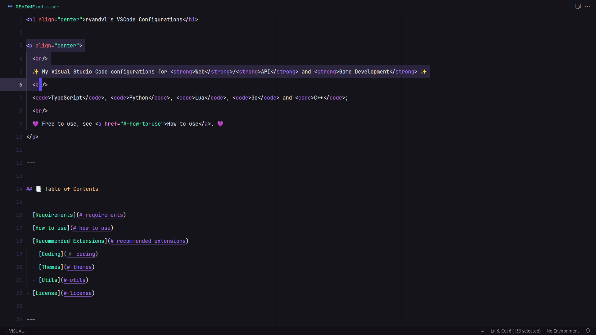

<h1 align="center">ryandvl's VSCode Configurations</h1>

   
  ✨ My compact VSCode configurations for <strong>Web</strong>/<strong>API</strong> and <strong>Game Development</strong> ✨
   
  <code>TypeScript</code>, <code>Python</code>, <code>Lua</code>, <code>Go</code> and <code>C++</code>;
   
  💜 Free to use, see <a href="#-how-to-use">How to use</a>. 💜

---

## 📑 Table of Contents

- [Requirements](#-requirements)
- [How to use](#-how-to-use)
- [Recommended Extensions](#-recommended-extensions)
  - [Coding](#️-coding)
  - [Themes](#-themes)
  - [Utils](#-utils)
- [Author](#-author)
- [License](#-license)

---

## 📋 Requirements

I am always using the most updated version of **Visual Studio Code** (Not required, but recommended to avoid bugs)
- You can download at: **[Visual Studio Code](https://code.visualstudio.com/)**.

---

## ❓ How to use

> [!WARNING]
> Tested on **[Linux Mint](https://linuxmint.com/edition.php?id=319)** only for my personal use.
>
> Make sure you know what you're doing, make a backup before.

 

There are two options, you can open **Show All Commands** with `Ctrl + Shift + P` (Or `Cmd + Shift + P` on MacOS) and select:
- **Preferences: Open User Settings (JSON)**;
  - Clear all and paste the [`settings.json`](settings.json).
- **Preferences: Open Keyboard Shortcuts (JSON)**;
  - Clear all and paste the [`keybindings.json`](keybindings.json).
- **Snippets: Configure Snippets**;
  - Select the file extension and search in the folder [`snippets`](snippets).
  - [`utils.code-snippets`](utils.code-snippets) is a **Global Snippets File**.

 

Or change files based on your **Operational System**:

<strong>Windows</strong> (Click to expand)

 

- VScode default configurations folder: `%APPDATA%\Code\User\`;
  - Example: `%APPDATA%\Code\User\settings.json`
- Settings file: `<folder>\settings.json`;
- Keybindings file: `<folder>\keybindings.json`;
- Snippets folder: `<folder>\snippets`

 

<strong>Linux</strong> (Click to expand)

 

- VScode default configurations folder: `~/.config/Code/User/` or `$HOME/.config/Code/User/`;
  - Example: `~/.config/Code/User/settings.json`
- Settings file: `<folder>/settings.json`;
- Keybindings file: `<folder>/keybindings.json`;
- Snippets folder: `<folder>/snippets`

 

<strong>MacOS</strong> (Click to expand)

 

- VScode default configurations folder: `$HOME/Library/Application Support/Code/User/`;
  - Example: `$HOME/Library/Application Support/Code/User/settings.json`
- Settings file: `<folder>/settings.json`;
- Keybindings file: `<folder>/keybindings.json`;
- Snippets folder: `<folder>/snippets`

---

## ⭐ Recommended Extensions

### ⌨️ Coding

- [Vim](https://marketplace.visualstudio.com/items?itemName=vscodevim.vim) - Vim emulation for Visual Studio Code (It's amazing).
- [Biome](https://marketplace.visualstudio.com/items?itemName=biomejs.biome) - BiomeJS integration.
- [ESLint](https://marketplace.visualstudio.com/items?itemName=dbaeumer.vscode-eslint) - Integrates ESLint JavaScript.
- [Prettier - Code formatter](https://marketplace.visualstudio.com/items?itemName=esbenp.prettier-vscode) - Code formatter using prettier.
- [Tailwind CSS IntelliSense](https://marketplace.visualstudio.com/items?itemName=bradlc.vscode-tailwindcss) - Tailwind CSS tool.
- [PostCSS Language Support](https://marketplace.visualstudio.com/items?itemName=csstools.postcss) - I recommend it.
- [Prisma](https://marketplace.visualstudio.com/items?itemName=Prisma.prisma) - Adds syntax highlighting, formatting, auto-completion, linting, etc for `.prisma` files.
- [Docker](https://marketplace.visualstudio.com/items?itemName=ms-azuretools.vscode-docker) - Docker management.
- [GitHub Actions](https://marketplace.visualstudio.com/items?itemName=github.vscode-github-actions) - GitHub Actions Workflows.
- [Postman](https://marketplace.visualstudio.com/items?itemName=Postman.postman-for-vscode) - I prefer the Postman app, but sometimes i use it.
- [REST Client](https://marketplace.visualstudio.com/items?itemName=humao.rest-client) - REST Client for VSCode (This extension is amazing).
- [Code Runner](https://marketplace.visualstudio.com/items?itemName=formulahendry.code-runner) - Run Code easily.

 

- [Go](https://marketplace.visualstudio.com/items?itemName=golang.go) - Go language support.
- [Python](https://marketplace.visualstudio.com/items?itemName=ms-python.python) - Python language support.
- [C/C++ Extension Pack](https://marketplace.visualstudio.com/items?itemName=ms-vscode.cpptools-extension-pack) - C/C++ language support.
- [Makefile Tools](https://marketplace.visualstudio.com/items?itemName=ms-vscode.makefile-tools) - Makefile support to C/C++.

---

### 🎨 Themes

- [Symbols](https://marketplace.visualstudio.com/items?itemName=miguelsolorio.symbols) - This is the only File Icon Theme that i use.
- [Material Icon Theme](https://marketplace.visualstudio.com/items?itemName=miguelsolorio.symbols) - I don't use anymore, but it's beautiful.

 

- [Aura Theme](https://marketplace.visualstudio.com/items?itemName=DaltonMenezes.aura-theme) - This is one of my favorite themes.
- [Omni Theme](https://marketplace.visualstudio.com/items?itemName=rocketseat.theme-omni)
- [Catppuccin](https://marketplace.visualstudio.com/items?itemName=Catppuccin.catppuccin-vsc) - Cat.
- [Min Theme](https://marketplace.visualstudio.com/items?itemName=miguelsolorio.min-theme)
- [Palenight Theme](https://marketplace.visualstudio.com/items?itemName=whizkydee.material-palenight-theme)
- [Dracula](https://marketplace.visualstudio.com/items?itemName=dracula-theme.theme-dracula)
- [Tokyo Night](https://marketplace.visualstudio.com/items?itemName=enkia.tokyo-night)

---

### 💯 Utils

- [WSL](https://marketplace.visualstudio.com/items?itemName=ms-vscode-remote.remote-wsl) - Open any folder in the WSL.
- [Color Highlight](https://marketplace.visualstudio.com/items?itemName=naumovs.color-highlight) - Highlight web colors in your editor.
- [Code Spell Checker](https://marketplace.visualstudio.com/items?itemName=streetsidesoftware.code-spell-checker) - Spelling checker for source code.
- [Error Lens](https://marketplace.visualstudio.com/items?itemName=usernamehw.errorlens) - Show Errors on lines.
- [Console Ninja](https://marketplace.visualstudio.com/items?itemName=WallabyJs.console-ninja) - Show logs with code lens.
- [Live Server](https://marketplace.visualstudio.com/items?itemName=ritwickdey.LiveServer) - Launch a development Local Server with live reload.
- [Bookmarks](https://marketplace.visualstudio.com/items?itemName=alefragnani.Bookmarks) - Mark lines and jump to them.
- [TODO Highlight](https://marketplace.visualstudio.com/items?itemName=wayou.vscode-todo-highlight) - Add TODO Support.
- [:emojisense:](https://marketplace.visualstudio.com/items?itemName=bierner.emojisense) - Adds suggestions and autocomplete for emojis.
- [Comment tagged templates](https://marketplace.visualstudio.com/items?itemName=bierner.comment-tagged-templates) - I recommend it.
- [Markdown Preview Github Styling](https://marketplace.visualstudio.com/items?itemName=bierner.markdown-preview-github-styles) - Changes markdown preview to match Github's style.
- [Markdown Checkboxes](https://marketplace.visualstudio.com/items?itemName=bierner.markdown-checkbox) - Checkbox support to markdown preview.
- [Markdown Footnotes](https://marketplace.visualstudio.com/items?itemName=bierner.markdown-footnotes) - Adds [\^footnote] syntax support to markdown preview.
- [Markdown Preview Mermaid Support](https://marketplace.visualstudio.com/items?itemName=bierner.markdown-mermaid) - Adds Mermaid diagram and flowchart support to markdown preview.
- [Version Lens](https://marketplace.visualstudio.com/items?itemName=pflannery.vscode-versionlens) - Shows the latest version for each package using code lens.
- [Discord Presence](https://marketplace.visualstudio.com/items?itemName=icrawl.discord-vscode) - Discord Rich Presence (be careful to not show private projects).
- [Project Manager](https://marketplace.visualstudio.com/items/?itemName=alefragnani.project-manager) - Separate projects.
- [Shader languages support for VS Code](https://marketplace.visualstudio.com/items/?itemName=slevesque.shader) - Highlight to shader languages.
- [Sort JSON objects](https://marketplace.visualstudio.com/items/?itemName=richie5um2.vscode-sort-json) - Sort JSON.
- [Template String Converter](https://marketplace.visualstudio.com/items/?itemName=meganrogge.template-string-converter) - Converts \"\<variable\>\" to \`\<variable\>\` in JavaScript.

---

## 🧑‍💻 Author

|  |
| :---: |
| **[ryandvl](https://github.com/ryandvl)** |

---

## 📝 License

This repository is licensed under the MIT License. See the [LICENSE](LICENSE) file for more details.
